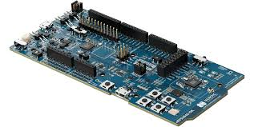

# BLUETOOTH

Keyboards are pretty simple. You press a button, your keyboard sends some sort of signal to your computer that represents the character you pressed, and your operating system determines how to act based on that character. Or in even shorter terms, you press a key and it appears on the screen. 

With that being said, making your own keyboard can really be as hard as you want, meaning you could do it at a doctorate in engineering level, or at a "buy the whole thing off ebay" level. I will do it at a bachelor's degree in computer engineering level. 

So, how to proceed.

Really the whole product is a printed circuit board with a SOC (system on chip) soldered on that communicates with the computer via USB and receives interrupt requests from buttons connected to the SOC's gpio pins. To begin, we might choose to design and manufacture the SOC entirely ourselves, but unless your [this guy](https://youtu.be/IS5ycm7VfXg?si=CZ-LuNtAJCt-T-ux), such an endeavour is extraordinarily difficult and borderline illegal.


Instead, we've got to go with something pre-made, and for that, I've chosen the Nordic nrf52840. Nordic is the hot name in bluetooth mcu's right now, and this is a beefy chip that can kind of do anything from Bluetooth Low Energy to Near Field Communication to any serial protocol. Plus, I happen to already have the chip's development board with me.



But that's not the only reason we're going with this SOC. 

One word. Zephyr. 

Nordic has gone all in on Zephyr now, abandoning support for the nrf5 sdk in favor of the best thing to happen to mcu's (in my opinion) ever. Using Zephyr, we can have a development environnment rivaling even the greatest (or least garbage) typescript ORM released on npm. The following images below might be a familiar sight to many other fellow computer engineering majors:


(I actually really like CubeIDE so excuse me here)

Massive and slow IDE's, eclipse/visual studio forks, and tightly coupled toolchains/editors. While effective, these programs are usually pretty annoying and all handle their toolchains completely differently. 
(For a particularly painful example of this, try installing AMD's Vivado, lol)

But with Zephyr, we can literally do everything with a text editor and the command line. That's it. Pure bliss.

However, that modularity and experience comes at a steep cost. Zephyr's learning curve is probably rivaled by only that of the notorious Yocto project, a tool for building entire linux distributions. Learning zephyr's device tree requires learning a book's worth of knowledge mostly inherited from building the linux kernel, but with a terrifying embedded systems twist. To illustrate, I came for the glorious STM32 Cube IDE where multiplexing a pin was as easy as clicking a drop-down and selecting UART. In zephyr, let's just say [this series of articles](https://interrupt.memfault.com/blog/practical_zephyr_basics) about the Zephyr device tree gets to that point in ***part five***.

Nonetheless, I want to show you another reason I love Zephyr. It is this: if you know how to write a standard C "Hello World" program, then *you already know how to write a Zephyr "hello world" program!* That's right. They're ***exactly*** the same. 

```
// Zephyr hello world, ripped straight from their own code samples
#include <stdio.h>
int main() {
        printf("Hello World\n");
        return 0;
}
```

Suffice to say, this is pretty amazing, and it's what got me hooked on zephyr as soon as I saw it. This will essentially be our entire software stack for the project. 

Once we've got our development board blinking an LED, we can then cut-open a USB cable to expose Data Plus and Data Minus wires to the development board and proceed to get a basic keyboard matrix working with just two characters

(insert keyboard matrix pic here)

With a couple characters appearing in bash from the nrf52840, that would conclude our breadboarding, as bluetooth will just be working with the SOC. We can then move on to making the printed circuit board, which we will do with KiCad because I don't have an altium license. After finding some suitable footprints and chomping away at a good PCB layout, we can have the board manufactured and solder up the design with some buttons. Viola: Bluetooth keyboard. After that, we could probably use another CAD software to 3D print an enclosure, but now we're getting ahead of ourselves. 

We'll get started with Zephyr in part II

