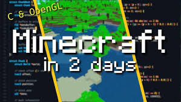

[Repository for this project](https://github.com/cade-th/interpreter_c)

Recently, I had the pleasure of seeing a great movie called "The Menu". A fascinating blend of thrill/suspense, satire, and philosophy, this film was well worth its hour and a half-ish runtime


Without revealing too much of the movie's plot, the story is centered around a ravish dining experience led by an imposing head chef and his legion of cooks who serve an array of pompous upper-class guests who don't care too much for their food (except only to criticize it whenever possible).
One of the story's main characters, Tyler, is a walking Dunning-Kruger of a man played by Nicholus Hoult


Tyler, unlike the other guests, has an extreme and sometimes violent reverence for the chef and his restaurant. He frequently describes every ingredient and aroma of his food in shakespearean terms and makes it a point to show the chef his enormous amount of knowledge of their menu and of food/cooking in general.  

Throughout the film's runtime, the chef pretends to be flattered by Tyler's frequent "pick me" moments and repeated attempts at impressing him. However, in a climatic turn of events, the chef instructs Tyler to come to the open-air kitchen in front of all the guests and put on a chef's apron. Tyler obliges, his enthusiasm still sky-high but a little shake in his seemingly unbreakable confidence now becoming visible. With Tyler clearly having everything he could possibly need to cook literally any dish ever, the Chef then gives Tyler a very simple directive:


*"Cook."*

Tyler freezes for a second, trying to reboot his brain's suddenly over-burdened operating system after a crash. He then begins to haggle together ingredients at random around the kitchen, pretends to cut meat very carefully while his hands shake at a gigahertz frequency, haphazardly throws some butter into a iron skillet, and "cooks" his dish. All this while every member of the kitchen observes intensely, satirically pretending to "learn" from Tyler's brilliance.  

This culminates in his dish's name aptly titled below:


Many a time, I will be sitting at my desk and a sudden wave of imposter syndrome will tumble over me like a suprise tsunami:

*"If you asked to write code right now, what would you do?"*

*"What could you do?"*

*"What do you actually know how to do?"*

My first ideas were usually like this:

1. Throw some javascript framework and postgres garage in the same vein of Tyler's Bullshit and call it a webapp
2. Pull out the Arduino IDE and make an LED blink
3. Starting typing away in bash and make the observer think I'm a super hacker-man
4. Install openbsd on a libre-booted thinkpad
5. Vomit out my wide array of tech buzzwords learned during my computer engineering degree like "C++ Template Metaprogramming" or "Clock Domain Crossing" or "Metal oxide semiconductor field effect transistor" or "Compile time polymorphism" or "source and load impedance matching" or "surface mount soldering" or "TCP/IP stack" or "Laplace domain analysis" or "SPI/UART/I2C serial communication" or "Device tree phandle array" or "hypercube based network topology" or "I haven't actually made anything but here's a fancy gatekeeping word to make you THINK that I have"

For a long time, this was mostly all I could think to do given the directive "Write code". 

And as an aspiring code chef looking to escape the LLM copy-paste apocalypse, I needed to do something better to avoid being a dunning-kruger like Tyler.

So, where to begin?

Well, we could definitely start where everyone probably should start with the simplest possible "Hello World" example. 

For me, in 2020 while in my freshman year in college, my Introduction to Computer Science One course did this with Java, and *DEAR GOD* is that the worst possible way to introduce people to programming. To illustrate, let's compare the Java "hello world" to the python and C "hello world":

```
// Java
public class HelloWorld {
    public static void main(String[] args) {
        System.out.println("Hello, World!");
    }
}
```

Nothing says programming is fun like forcing your student's to learn 9 different keywords and basic OOP and many java-specific types *JUST* to do what is literally this in python:

```
print("hello world");
```

and this in C:
```
#include <stdio.h>
  void main() {
    println("hello world");
  }
```

Tangents about computer science education aside, if told to "Code." I would start with the standard C "hello world". After, of course, undergoing the hideous nightmare of setting up C/C++ build systems and reading an entire book about CMake so I can write code for my meta-build system to generate my make-based build system that generates my final, insanity-based build system that runs shell commands that call Clang or gcc in whatever way with which monopolistic hardware vendors want to slam unsuspecting victims with patent trolls so that not even the biggest company in the world can build a cellular modem - wait, what was I talking about again?

A tourist's guide to Interpreters in C, ah.

This C program obviously doesn't do much and would only impress your local bean-counter, so let's improve it by doing the next logical step up: a simple command line program.

A tip I picked up from The Rust Book is to create and parse a config struct for the programs command-line arguments like below, and abstract the programs main functionality into a separate function:

```
#include <stdio.h>

void main(int argc, char* argv[]) {
       Config config = config_build(argc,argv);
       run(config);
}
```

I'll show the config struct and skeleton of the build function below. The enum for the config type is probably overkill, but for most other cli programs, the enum would definitley have more entries:

```

typedef enum {
        Shell,
        File
} Config_t;

typedef struct {
        Config_t type;
        char *file_path;
        int num_args;
} Config ;

Config config_build(int argc, char *argv[]) {
        Config config;
        switch(argc) {
                case 1:
                        printf("%s\n", argv[1]);
                        config = (Config) {
                                ???
                        };
                        return config;
                default:
                        printf("No or too many arguments\n");
                        exit(1);
        }
}

void run() {
        // do stuff
}
```

There. Instead of printing a string to the console, our program now prints to the console whatever you enter as a command line argument.
But what we have here is really still about equivalent to Tyler's Bullshit, so how could we take this further?

Well, usually at this point, a lot of people start writing graphics engines with something like SDL or raylib because some visual output is a much more appealing sign of progress than printing stuff.

Something like in what youtuber JDH makes (far and away my favorite youtuber of all time)


That can certainly last you a long time, but game/graphics programming tends be a far-cry from the tasks you'd normally get in the software industry, therefore, for our "Code." approach, we'll stick to some kind of CLI program.
The next logical evolution taught in most CS courses would be a REPL (read, execute, print, loop) program where the user has some kind of prompt, the program reads data from the user, and the program executes something based off that data. This will normally get you fun text-based adventure games like my absolute favorite [A Dark Room](https://www.google.com/url?sa=t&source=web&rct=j&opi=89978449&url=https://adarkroom.doublespeakgames.com/&ved=2ahUKEwi2yrvZv7CMAxWiLtAFHch_AWoQFnoECAoQAQ&usg=AOvVaw0BNnJzQXsfTgf3psPTQY_z)

But even that won't use many programming concepts for long. What we really need is a CLI program that we could write from the bottom up, on the spot, that encapsulates a number of programming concepts while also being something you see at any standard software company. 

I would argue an interpreter is ***exactly*** that.

If someone told me "Code." I would write an interpreter.

This interpreter will act similarly to something like sqlite, where its behavior will depend on whether the user wants a shell or to run the program from a file. We can begin this by modifying the switch statements in config_build():

```
	switch(argc) {
		case 1:
			printf("Running Shell...\n");
			config = (Config){ 
				Shell, 
				NULL, 
				argc 
			};
			return config;		
		case 2:
			printf("Running File with file path: %s\n", argv[1]);
			config = (Config) {
				File,
				argv[1],
				argc
			};
			return config;
		default:
			printf("Usage: idk [script]\n");
			exit(1);
			break;
	}
```

and modify the run function to reflect our config with two functions we'll fill out:
void run(Config config) {
        if (config.type == Shell) {
                run_shell();
        }
        else {
                run_file(config.file_path);
        }
}

Run file will simply slurp up the file contents into a string and return it for when we build a lexer:

```
char *run_file(char *file_path) {
        FILE *file = fopen(file_path, "rb");
            if (!file) return NULL;

            fseek(file, 0, SEEK_END);
            long size = ftell(file);
            rewind(file);

            char *buffer = malloc(size + 1); // +1 for null terminator
            if (!buffer) {
                fclose(file);
                return NULL;
            }

            fread(buffer, 1, size, file);
            buffer[size] = '\0'; // Null-terminate the string
            fclose(file);
            return buffer;
}
```

Now, we can proceed to make what every person who doesn't go outside much loves: a shell.

```
void run_shell() {

        bool should_quit = false;
        char input[20];

        while (!should_quit) {
                printf("cade_lang> ");

                if (fgets(input, sizeof(input), stdin) == NULL) {
                    break;
                }

                size_t len = strlen(input);
                if (len > 0 && input[len - 1] == '\n') {
                    input[len - 1] = '\0';
                }

                if (strlen(input) == 0) continue;

                if (strcmp(input, ".quit") == 0) {
                    should_quit = true;
                    continue;
                }

        }
}
```


Here we do an infinite loop where we print the shell prompt and get whatever the user puts, while allowing the user to do the sqlite-esc .quit command to break the loop. And with that, we have a shell just like you'd see in bash or in sqlite:

```
cade_lang>
```

Our shell can't do anything besides quit for now, but we'll do the next step in making an interpreter by splitting up the inputted string into ***tokens*** with a tokenizer, which will form the real meat of the interpreter.


[Check out part 2 here](cadethornton.com/posts/interpreters_p2)


