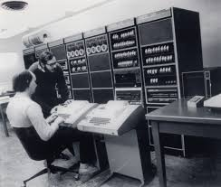

As an avid minimalist, I try my best to do the most with little. In terms of computers, that has meant using some flavor of Unix. I'm writing this post on Ubuntu, and I carry around a libre-booted thinkpad running OpenBSD. However, the idea of architecting my own OS has always seemed like a pipe dream due to how complex Linux distributions appeared to be. Many tutorials for accomplishing this task will reflect something like LFN (Linux from scratch) or use a meta-build tool like Yocto to abstract much of the complexity, but I want to prove in this article that setting up your own, reproducible Linux system can be fairly simple. We will attempt first to just get a simple bash shell going, and then scale up from there with X11/Wayland and networking in further articles. 



The entire tutorial will be in a series of bash scripts to try and get a more declarative approach to things instead of me just listing out shell commands over and over until we magically get Hello World.

This will be this part's outline:

1. Create the root file system (which we'll call /initramfs) with typical Unix directories (proc,sys,tmp,lib,dev,etc/network,usr)
2. Build the kernel (Linux)
3. Build userspace programs like cd, ls, etc (Busybox)
4. Make device nodes in /dev
5. Create an init script for the kernel
6. Zip the root filesystem and run it in Qemu
7. Test a userspace program like "echo" in our shell.
8. DONE!


# TO BEGIN

We'll setup our script with a shebang:
```
#!/bin/bash
```

We'll install some debain packages we'll need for build the kernel, libc, etc:
```
sudo apt update -y
sudo apt install -y build-essential gcc g++ make libncurses-dev bison flex libssl-dev libelf-dev bc autoconf automake libtool git qemu-system-x86 cpio gzip
```
and create the top most directory in our root file system where our entire Linux distribution will live, with all your usual Unix directories:
```
rm -rf initramfs/*
mkdir -p initramfs/{proc,sys,tmp,lib,dev,etc/network,usr/share/udhcpc}
```

And then we can get right to building our two most essential components, the kernel and userspace Unix programs (for which we will go with Busybox).
Github has some nice mirrors for these:
```
if [ -d "./linux"]; then
    git clone https://github.com/torvalds/linux
    git clone https://github.com/mirror/busybox
fi
```

I'll compile the kernel with it's default kernel config and with all of my cpu's available cores

```
cd ./linux
        make defconfig
        make -j$(nproc) bzImage
cd ..
```

and do the same for busybox:
```
cd ./busybox
    make defconfig
    make -j$(nproc)
    make install
cd ..

cp -a busybox/_install/* initramfs/
```

Now that we've got Linux and Busy box built, we'll need some device nodes in /dev so that we can use our tty among other things like get random numbers, etc

```
cd initramfs
    sudo mknod -m 622 dev/console c 5 1
    sudo mknod -m 666 dev/null c 1 3
    sudo mknod -m 666 dev/zero c 1 5
    sudo mknod -m 666 dev/tty c 5 0
    sudo mknod -m 666 dev/tty0 c 4 0
    sudo mknod -m 666 dev/random c 1 8
    sudo mknod -m 666 dev/urandom c 1 9
    sudo mknod -m 600 dev/eth0 c 10 1
cd ..
```
Our systems needs an init script on boot that mounts the /proc, /sys, and /dev directories for the kernel, so we'll create a script INSIDE this script to do that via cat:

```
cat > initramfs/init << EOF
#!/bin/sh

# Set up initial configuration
mount -t proc proc /proc &
mount -t sysfs sysfs /sys &
mount -t devtmpfs devtmpfs /dev &

# Init messages
clear
echo "Welcome to CadeDOS!"
date
free -h | grep Mem
echo ""

# Start task
setsid cttyhack sh
exec /bin/sh
poweroff -f
EOF
chmod +x initramfs/init
```

and believe it or not, that's all we need for our distrobution for now! We can proceed to zip everything using this old unix tool that the kernel demands (cpio):
```
cd initramfs
    find . | cpio -o -H newc | gzip > ../initramfs.img
cd ..

cp linux/arch/x86/boot/bzImage bzImage
```

and drumroll... boot it all into QEMU. Bam! A minimal linux system built using a single shell script in about five minutes:
```
qemu-system-x86_64 -m 2G -kernel bzImage -initrd initramfs.img -append "console=ttyS0 init=/init quiet loglevel=3" -nographic -net nic -net user
```

In part II, we'll get some networking going and try to ping my home network from inside QEMU
