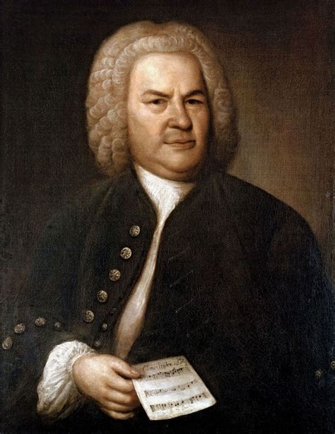
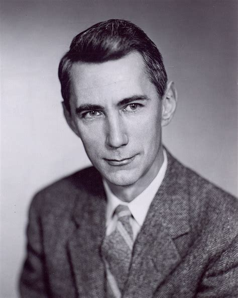
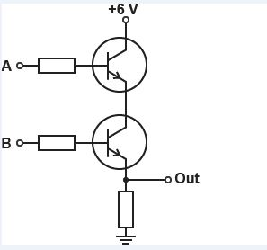
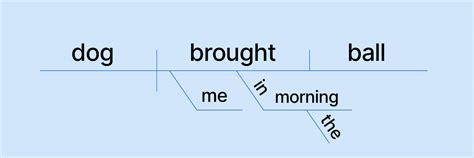
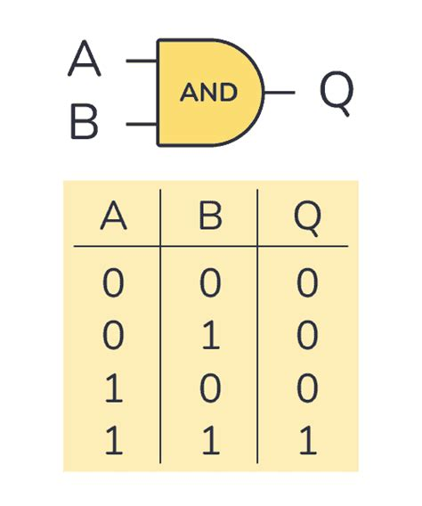
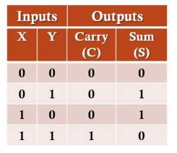
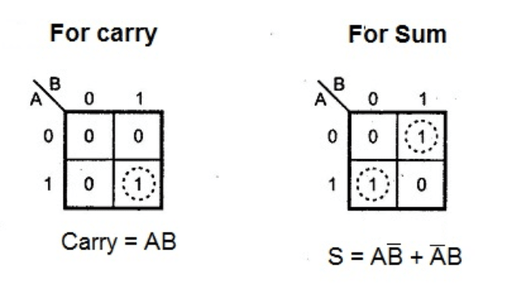
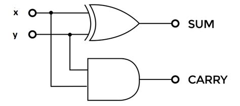

## How to Make Rocks Add Numbers

Johann Sebastian Bach created what is essentially the musical equivalent of E = MC^2 in his collection of preludes and fugues for A Well-Tempered Clavier. His demonstration that, using equal tempermant, one can play in each of the 12 keys, without any one key sounding more or less dissonant than the other has been called such a musical flex that to have included it in the Voyager spacecraft for other potential space-faring civilizations to see would have been *too boastful*

Since that piece, almost all of western music has followed equal-temperment ever since. One man and one piece directly influence almost all of humanity for hundreds of years.

In addition to this discovery and Einstein's, there is another person who has had an almost equivalent impact on humanity, but in the realm of computing, and anyone involved in that field can probably guess that I'm talking about Claude Shannon (after whom Anthropic's flagship AI model is named).

"A symbolic analysis of relay and switching circuits" in layman's terms and horrifically oversimplified, demonstrates a connection between Boolean algebra and physical switching circuits: "any theorem of the Calculus of Propositions is also a true theorem if interpreted in terms of relay circuits" -from the thesis. This claim single-handedly shifted humanity's focus from analog computing to the vast world of digital computing that dominates technology today. 

I learned these "switching circuits" in college as logic gates: different arragements of transistors that form propositions like "And", "Or", "Not", etc. I had always dreamnt about the finding the hard-line that bridged the real world to the words I'm typing on my screen right now. The field of digital logic was that line and is what inspired an insatiable curiosity about computers in me throughout my degree and for the rest of my life. 

What does this have to do with HDL's and system verilog? I'm getting there.

So we have logic gates. How do we make them and what can we do with them? The first place to begin here is with a simple AND gate. If we take two transistors and wire them in series with each other, connecting power to the first and ground to the second, we can be assured that current will only reach ground (or an LED etc.) when BOTH transistors are turned on, forming the logical AND operation:

We can then represent the operation of this gate graphically using what's called a truth table. You can think of truth tables almost roughly analogous to sentence diagrams, where the inputs are the subject and the outputs are the verbs:

but like this:

Other gates like OR, NOR(or but inverted), NAND(AND but inverted), XOR (exclusive or), etc can be constructed in a similar manner from any type of switch circuit, whether it be a MOSFET, BJT, or redstone torch in minecraft :). 

What most people have wanted computers to do has been calculation, so how to we make a calculator out of these gates? Well, we in order to do that, we have to describe the inputs and outputs of our new device along the same vein of the AND gate. Our device will have two inputs, X and Y, and two outputs, the sum of the calculation and the carry value like so:

You can verify for yourself that "0 plus 0 is 0, 1 plus 0 is 1, 1 plus 1 is 1 0 with a carry" visually. Now that we know what our primitive one digit binary calculator will operate, how do we synthesize it? At first glance, the process for this appears fairly complicated and arbitrary, but (at least for combinational logic) the steps repeat for any state machine or device you can think up with a truth table.

First we construct what's known as a Karnaugh map, which is a tool that allows us to extract a complete, simplified boolean algebra function from any truth table. We draw a grid with each of our outputs in a specfic order, and by grouping either "1"s or "0"s together (called minterms or maxterms) and compare them to the inputs (written outside the grid). So the example would look like this:

In this case, we're using the minterms (1's). Carry's equation is logical AND (AB) and the sum is A~B + ~AB, which is actually simply A XOR B. 

From these two equations, the physical circuit can be constructed using logic gates as shown:

There. Using anything capable of switching, we have engineered a one digit calculator (also known as a half-adder). Rocks adding numbers.

And really, this is how computing evolved after World War Two for a while. Hand-drawn schematics from logic gates along the same realm as hand-drawn printed circuit board schematics. However, as computing became more complicated from one bit numbers all the way to 64 bit numbers, this approach didn't really scale well and another abstraction was needed to construct the vast oceans of design that exist even in the simplest of a single chip today. 

That abstraction became hardware description languages, a tool for programatically describing hardware.

[Check out part 2 here](cadethornton.com/posts/system_verilog_p2)

